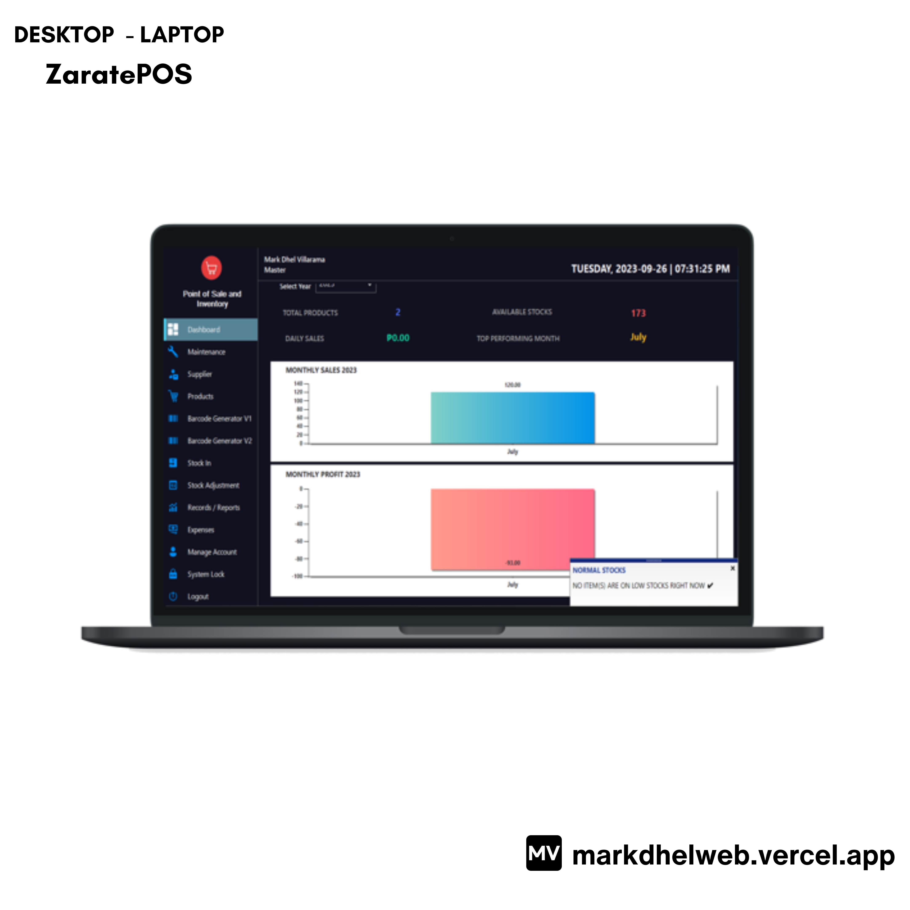
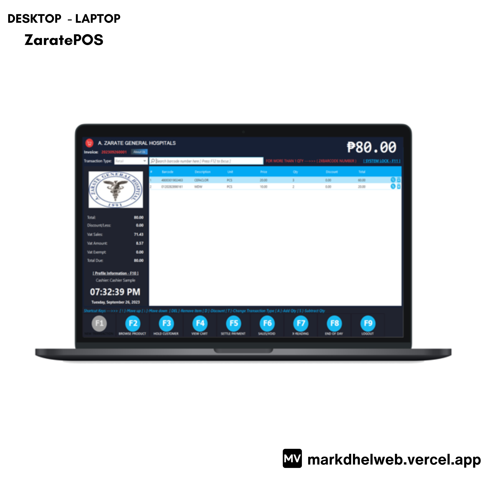
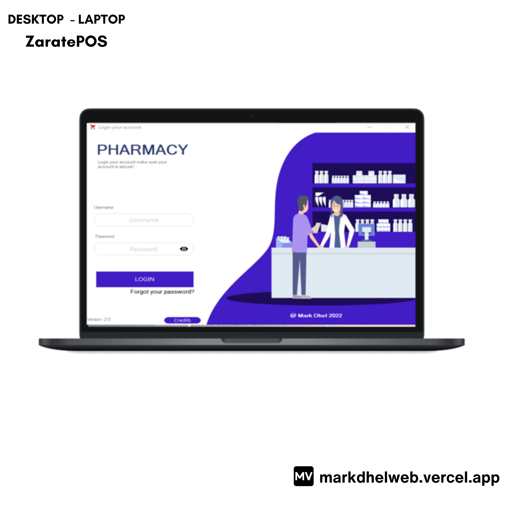

<!-- markdownlint-configure-file {
  "MD013": {
    "code_blocks": false,
    "tables": false
  },
  "MD033": false,
  "MD041": false
} -->

  

# ZaratePOS 

This application is ready to use features that are completely easy to use for any user.

## Features

1. Inventory Features
- Dashboard
- Notification products (Normal / Low on Stocks)
- Sales and Profit (per month)
- Company Details
- Discount
- Supplier Module
- Products Module(Barcode / Non-Barcode,Import / Export CSV,Print Products,Vat / Non-Vatables)
- Barcode Generator
- Stock In / Stock Adjustment
- Reports(Sales Summary,SalesProfit,DailySales,Z-Reading,StockMovementItems,CriticalStocks,FastMovingItems,VoidHistory,LogHistory)
- Expense
- Manage Account
- System Lock
- X and Z Reading can be filter by accounts/ users and date
- Print all reports / Category List / WholeSale/Retailer Pricing / Supplier Information List
- Supplier Items (list / Purchase / Damage / Return
- Auto Search / Filter By Date
- Online Backup via google drive
2. Pos Features
- Start/End of the Day
- User Profile
- New Transaction
- Browse Product / Scan the barcode (automatic)
- Settle Payment (automatic print receipt/manual)
- Sales/Void
- X-reading / System lock / Shortcuts keys
- Void transaction with password
- Senior citizen and PWD discount available

## Built With

- [VB.NET](https://learn.microsoft.com/en-us/dotnet/desktop/winforms/overview/?view=netdesktop-7.0) - i use windows form to develop
- [SqlServer](https://www.microsoft.com/en-us/sql-server/sql-server-downloads) - i use it for database
- [CrystalReport](https://www.sap.com/index.html) - to generate reports
- [Guna](https://gunaui.com/) - to create cool UI too

## Software Development

Demo: [https://youtu.be/WWddRZYlaHc?si=Sa-jsbAjbO5xSb2N]

🪟: [Desktop - Laptop]

